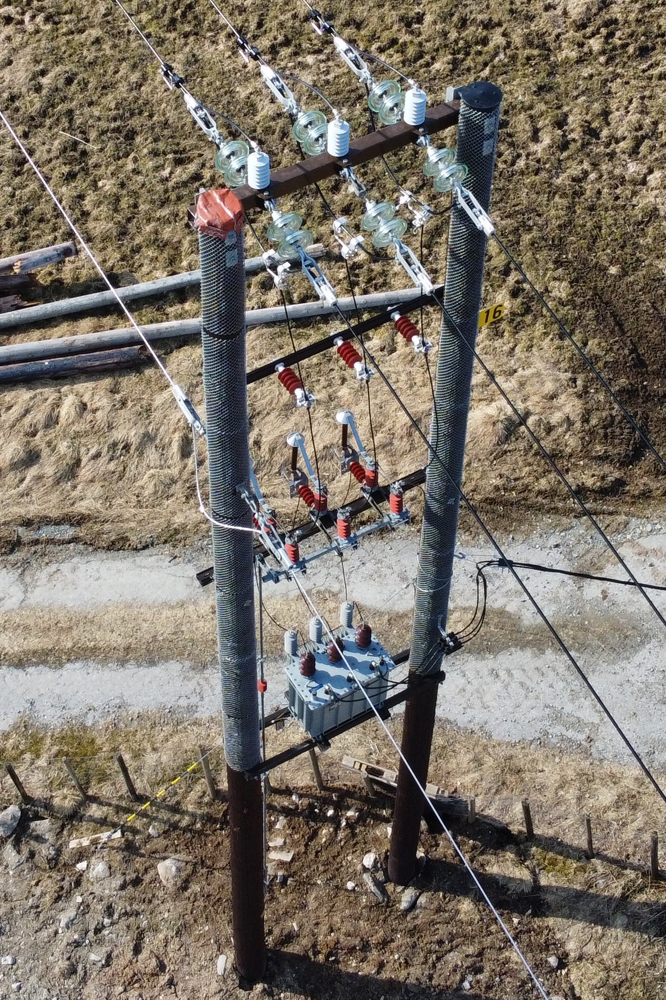

# Inspecting power systems

 **Task defined in the project catalog:**

> Drones enable visual inspection of power lines. Combined with computer vision and autonomous navigation, they can provide a cheap and accurate way to assess conditions and detect defects, even in remote or rugged areas. Drones equipped with high-resolution cameras can capture images of power lines from different angles, allowing fordetailed inspections of the lines for any signs of damage or wear.Equipped with thermal sensors able to see “hot spots,” their utility is further expanded, enabling the detection of loose connections or other equipment failures. The drone data can be transmitted in real-time to a remote monitoring station, allowing for real-time monitoring of the power lines and rapid response to any detected issues Goals

* Create a system to precisely locate power lines in images collected from drones.
* To broaden the project’s perspective, you can investigate ways to detect and classify power stations from aerial imagery.

The ability to identify key components from drone imagery could be a extremly useful as part of another pipeline to for example detect faults or relating real world components to virtual components. For example in using a drone to map powergrids for [NVE Atlas](https://atlas.nve.no/Html5Viewer/index.html?viewer=nveatlas#).

**My Goals:**

* Detect powerlines, masts, transformers and top-covers from drone images.

This migth seem like a simple goal, but this is critical for alot of systems.

**Open datasets:**

1. PLD-UAV data set: [GitHub](https://github.com/SnorkerHeng/PLD-UAV). This dataset has labeled data of power line images in both urban and mountainus terrain. Limited to only images of powerlines. Not able to implement anything else than power line detection.
2. OGNet data set: [Stanford ML Group](https://stanfordmlgroup.github.io/projects/ognet/). This is a data set of oil refineries. Still, the methods and experience you’ll obtain from studying this data set will be highly generalizable to similar problems (if you get a hold of labeled data).
3. Self collected data using a DJI-mini 2 drone flown in Sogn og Fjordane, Norway. [GitHub link](https://github.com/snadderbyte/powerstations). These images were croped into a 4:3 ratio, and then label using label-studio.

I Will be using the third dataset for this project.

## Problem

### **How could deep learning help the industry using aerial imagery?**

Drone imagery is already used in the industry for maintenance and failure detection.

**Example cases:**

* *A region loses power due to a tree falling over the power lines. To find where the failure is the drone is flown along the lines until the failure is found. *
* *Power lines are critical infrastructure and therefore require regular maintenance. A drone could be flown along the lines to find the irregularities and other artifacts, such as missing or damaged top covers, that could compromise the infrastructure.*

### **What am I trying to identify?**

The picture below show a wooden mast with a transformer and one missing top-cover. Top-cover are the black circles on top of each pole these play a critical role in safety. Without them the masts rots extremly fast, and this rot is extremly hard to detect, because the mast will remain stading even though its rot has hollowed out the core of the mast. Transformers are the metal boxes attached half-way up the mast.

## Solution

